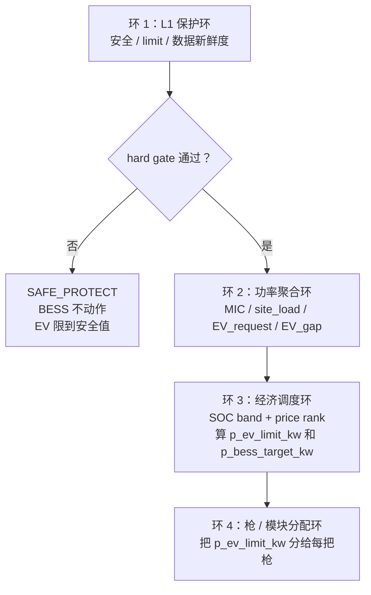

# M1 本地控制四个环说明 v0.1

日期：2026-05-28

用途：把 M1 本地控制拆成四个环，明确每个环做什么、谁负责、我们当前算法负责哪一块。

---

## 0. 一句话结论

M1 本地控制不是一个单独算法，而是四个环叠在一起：

```text
L1 保护环
  ↓
功率聚合环
  ↓
经济调度环
  ↓
枪 / 模块分配环
```

我们当前写的 M1 v0.2 算法，只负责第三个：

```text
经济调度环
```

其他三个环需要写清楚边界，但这一版不由我们重做。

---

## 1. 四个环总览

| 环 | 名称 | 做什么 | 当前责任 |
|---|---|---|---|
| 1 | L1 保护环 | 判断现场是否安全，设备是否允许动作 | 已有 EMS / BMS / PCS / MIC |
| 2 | 功率聚合环 | 计算 AC 负荷、EV 需求、MIC 余量 | IT / EMS 本地数据侧 |
| 3 | 经济调度环 | 根据 SOC band、价格 rank、EV gap 决定 BESS 和 EV 输出 | 我们当前负责 |
| 4 | 枪 / 模块分配环 | 把 EV 总功率分给每把枪、每个模块 | 充电桩 / 优优利特 / IT |

---

## 2. 环 1：L1 保护环

### 它做什么

L1 保护环是 hard gate。

它负责判断：

```text
BMS 是否正常
PCS 是否正常
SOC 是否触发硬上限 / 下限
MIC 是否触发保护
数据是否新鲜
设备是否允许执行
```

如果 L1 不通过，后面的经济调度不应该继续自由决策。

### 我们怎么用它

我们不重写 L1 保护逻辑。

我们只读取它给出的结果：

```text
site_safe
data_fresh
bess_protection_ok
PCS_charge_limit
PCS_discharge_limit
BMS_charge_limit
BMS_discharge_limit
SOC_charge_limit
SOC_discharge_limit
```

### 输出到我们这一层

L1 给 L2 的信息可以理解成：

```text
现在能不能动？
最多能充多少？
最多能放多少？
数据是否可信？
```

如果 L1 不通过，我们直接输出：

```text
mode = SAFE_PROTECT
p_bess_target_kw = 0
p_ev_limit_kw = safe_ev_limit_kw
```

---

## 3. 环 2：功率聚合环

### 它做什么

功率聚合环负责看现场功率关系。

它关心：

```text
站点 AC 负荷是多少？
EV 当前请求多少功率？
MIC 还剩多少可用空间？
EV + AC 加起来会不会超过 MIC？
```

### 我们怎么用它

我们的公式需要这些数据：

```text
MIC
site_load
EV_request
```

然后计算：

```text
H_t = 当前可用电网余量
EV_gap_t = EV 请求里电网余量满足不了的部分
```

### 注意

这里的 `site_load` 口径必须确认：

```text
site_load 应该是不含 EV、不含 BESS 充放电的 AC 聚合负荷
```

如果 site_load 口径不同，公式里的加减号会变。

---

## 4. 环 3：经济调度环

### 它做什么

这是我们当前负责的 M1 v0.2 算法。

它回答四个问题：

```text
BESS 现在要不要充电？
BESS 现在要不要放电支援 EV？
EV 总功率要不要限制？
限制到多少？
```

### 它用什么输入

来自云端：

```text
SOC band:
  soc_p10
  soc_p25
  soc_p50
  soc_p75
  soc_p90

price rank:
  buy_rank_t
  spread_rank_t

调参参数:
  margin
  f1_chg / g_chg
  f1_dis / g_dis
  slew_kw
```

来自本地：

```text
MIC
site_load
EV_request
SOC
```

来自 L1：

```text
安全状态
充电 limit
放电 limit
数据新鲜度
```

### 它的核心逻辑

先算物理上限，再算使用比例：

```text
实际功率 = 物理上限 × 使用比例
```

价格只影响“使用比例”，不能额外增加 kW。

所以不会写成：

```text
实际功率 = 物理上限 + 价格奖励
```

### 它输出什么

经济调度环输出固定为：

```js
Y_t = {
  mode,
  p_ev_limit_kw,
  p_bess_target_kw,
  reason_code
}
```

含义：

| 字段 | 含义 |
|---|---|
| `mode` | 当前策略状态 |
| `p_ev_limit_kw` | EV pool 总功率上限 |
| `p_bess_target_kw` | BESS 目标功率，正数充电，负数放电 |
| `reason_code` | 为什么这样输出 |

---

## 5. 环 4：枪 / 模块分配环

### 它做什么

枪 / 模块分配环负责把 EV 总功率分下去。

例如：

```text
1 号枪给多少 kW？
2 号枪给多少 kW？
新来的车是否先给高功率？
多个功率模块怎么分？
是否先来先得？
是否需要 load balancing？
```

### 我们当前怎么处理

我们这一版不做每把枪分配。

我们只输出站级总功率：

```text
p_ev_limit_kw = P_gun_pool_max
```

也就是说，我们告诉 EV 侧：

```text
当前 EV pool 总共最多能用多少功率
```

至于这个总功率怎么分到每把枪，由充电桩 / 优优利特 / IT 那一环处理。

### 为什么要记录这个环

Ning 提到优优利特现有逻辑可能有问题：

```text
模块分配可能偏先来先得
新来的车可能一开始拿不到高功率
用户体验可能不好
```

但这个不是 M1 v0.2 经济调度公式要直接修改的内容。

这一版只记录风险，后续单独 review。

---

## 6. 四个环之间的关系



---

## 7. 当前交付边界

当前我们真正要交付的是：

```text
环 3：M1 经济调度算法
```

但文档要把四个环都写出来，是为了避免误解：

```text
L1 保护不是我们重做
功率聚合数据需要 IT / EMS 给
经济调度是我们负责
枪分配这一版不改
```

---

## 8. 对外口径

可以这样说：

> 我们把本地控制拆成四个环：L1 保护环、功率聚合环、经济调度环、枪/模块分配环。当前 M1 v0.2 只实现第三个经济调度环。它在 L1 hard gate 通过后运行，读取本地 MIC、site load、EV request、BESS limit，以及云端下发的 SOC band 和 price rank，输出站级 `p_ev_limit_kw` 和 `p_bess_target_kw`。L1 保护和枪分配不在这一版重做，只作为接口边界和后续 review topic。

