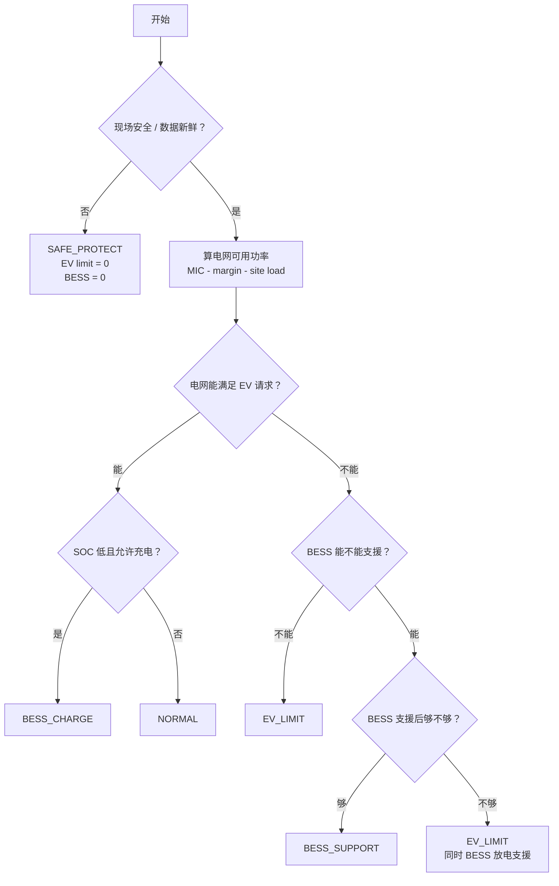

# M1 本地算法说明 v0.1

日期：2026-05-28  
用途：用一页说明 M1 本地算法闭环，便于和 IT / 硬件侧确认。

---

## 1. 范围

当前只讨论 M1：

```text
BESS + EV
Import Only
无 PV
无 export
无 V2G
```

这版只定义本地 L2 最小规则算法。

PPT 里的对应关系：

```text
L3 云端 advisory  -> 下发 SOC band
L2 本地协调       -> 本文算法
L1 D 快环         -> 已有硬保护，提供保护状态 / limit
```

本地算法不重做 L1 硬保护，只读取已有系统给出的：

```text
现场安全状态
BESS 可支援状态
PCS / BMS / SOC limit
```

---

## 2. 输入 X_t

MVP 最小输入分三类。

### A. 云端 SOC guidance

云端直接下发 SOC band，30min 粒度：

```text
soc_p10
soc_p25
soc_p50
soc_p75
soc_p90
```

MVP 主算法先只用：

```text
soc_p25
```

规则：

```text
SOC < soc_p25  -> BESS 不放电支援 EV
```

### B. 本地站点实时状态

建议 1s 或 3s 粒度：

```text
MIC
MIC_margin
site_load
EV_request
```

含义：

```text
MIC         站点最大允许从电网取电功率
MIC_margin  MIC 安全余量
site_load   站内 AC 聚合负荷，不含 EV
EV_request  当前 EV pool 请求功率
```

### C. 已有 L1 保护状态 / limit

来自 EMS / BMS / PCS / 本地保护层：

```text
data_fresh
charger_status / site_status
BMS_status
PCS_status
SOC
SOC_min
PCS_discharge_limit
BMS_discharge_limit
SOC_discharge_limit
```

这些不要求系统里就叫某个固定字段名。MVP 只需要能判断两件事：

```text
site_safe       现场是否允许继续给 EV 输出功率
bess_available  BESS 当前最多能支援多少功率
```

如果已有系统可以直接给：

```text
BESS_available
```

则本地算法可以直接使用，不必再拆 `PCS / BMS / SOC` 三个 limit。

---

## 3. 输出 Y_t

M1 MVP 输出固定为：

```js
Y_t = {
  mode,
  p_ev_limit_kw,
  p_bess_target_kw,
  reason_code
}
```

字段解释：

| 字段 | 含义 |
|---|---|
| `mode` | 当前本地策略状态 |
| `p_ev_limit_kw` | EV pool 最大允许功率，可对接为 `P_gun_pool_max` |
| `p_bess_target_kw` | BESS 目标功率，正数充电，负数放电，0 不动 |
| `reason_code` | 当前输出主原因 |

`mode`：

```text
NORMAL
BESS_SUPPORT
EV_LIMIT
BESS_CHARGE
SAFE_PROTECT
```

`reason_code`：

```text
NORMAL
EV_DEMAND_HIGH
MIC_LIMIT
SOC_LOW
PCS_LIMIT
BESS_FAULT
DATA_STALE
```

---

## 4. 流程图



---

## 5. 数学公式

### 5.1 电网可用功率

```text
P_grid_available,t = max(0, MIC_t - MIC_margin_t - site_load_t)
```

### 5.2 EV 缺口

```text
EV_gap_t = max(0, EV_request_t - P_grid_available,t)
```

### 5.3 BESS 可支援能力

如果已有系统直接提供 `BESS_available_t`，则直接使用。

如果没有，则：

```text
BESS_available_raw,t = min(
  PCS_discharge_limit_t,
  BMS_discharge_limit_t,
  SOC_discharge_limit_t
)
```

再经过保护条件和 SOC band：

```text
BESS_available_t =
  if BMS / PCS / BESS protection OK
     and data_fresh_t = 1
     and SOC_t >= soc_p25_t:
       BESS_available_raw,t
  else:
       0
```

### 5.4 BESS 支援功率

```text
P_bess_support_t = min(EV_gap_t, BESS_available_t)
```

### 5.5 EV pool 限额

```text
p_ev_limit_kw,t =
  if site protection not OK or data_fresh_t = 0:
    0
  else:
    min(EV_request_t, P_grid_available_t + P_bess_support_t)
```

### 5.6 BESS target

放电支援时：

```text
p_bess_target_kw,t = -P_bess_support_t
```

如果需要 BESS 充电：

```text
p_bess_target_kw,t = P_bess_charge_t - P_bess_support_t
```

其中：

```text
p_bess_target_kw > 0  BESS 充电
p_bess_target_kw < 0  BESS 放电
p_bess_target_kw = 0  BESS 不动
```

---

## 6. mode 判断

```text
if site protection not OK or data_fresh_t = 0:
    mode_t = SAFE_PROTECT

elif p_ev_limit_kw_t < EV_request_t:
    mode_t = EV_LIMIT

elif P_bess_support_t > 0:
    mode_t = BESS_SUPPORT

elif P_bess_charge_t > 0:
    mode_t = BESS_CHARGE

else:
    mode_t = NORMAL
```

说明：

```text
如果 BESS 已经支援，但 EV 仍拿不到请求功率，
主 mode 仍然是 EV_LIMIT。
BESS 是否支援可以从 p_bess_target_kw < 0 看出来。
```

---

## 7. 文字解释

M1 本地算法先看现场是否安全、数据是否新鲜。如果现场保护条件或数据新鲜度不过，直接进入 `SAFE_PROTECT`，EV pool 限额设为 0，BESS 不动作。

如果 site 侧正常，算法先用 `MIC - MIC_margin - site_load` 算出当前电网还能给 EV pool 的功率。然后用 `EV_request - P_grid_available` 算 EV 缺口。

如果 EV 有缺口，BESS 只有在已有 L1 保护允许、数据新鲜、且 SOC 不低于云端 `soc_p25` 时，才允许放电支援。BESS 支援功率取 EV 缺口和 BESS 当前可用功率的较小值。

最后，本地输出 EV pool 最大允许功率 `p_ev_limit_kw`，以及 BESS 目标功率 `p_bess_target_kw`。EV 侧只接收站级总功率上限，不做每把枪分配。
