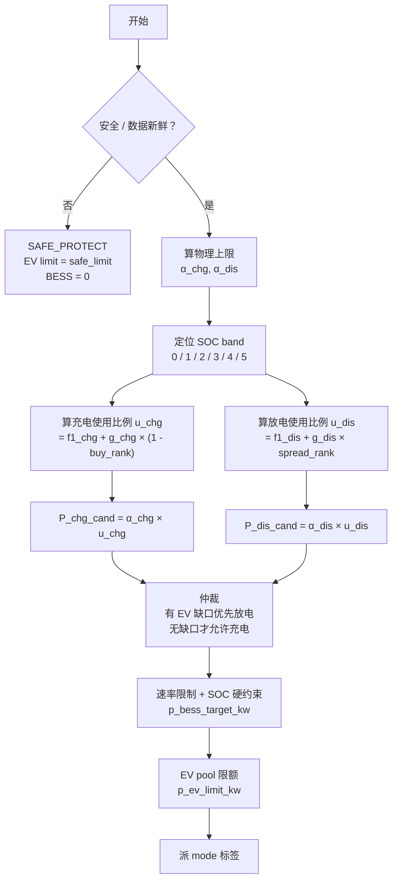

# M1 本地算法说明 v0.2

日期：2026-05-28
用途：在 v0.1 基础上引入价格信号和 SOC band 全量使用，给 IT / 硬件侧和 Ning 一份可审、可测、可调的形式化版本。

相对 v0.1 的变化（一图概述）：

```text
v0.1 逻辑：  EV 有缺口?  -> BESS 补
            没缺口?      -> SOC 低则充

v0.2 逻辑：  算 物理上限 α
            算 使用比例 u ∈ [0, 1]   (由 SOC band + 价格 rank 决定)
            候选功率 = α × u         (先不破物理上限)
```

关键不变量：`u ≤ 1`，所以候选功率 `P ≤ α`。最终还要经过 slew、SOC 硬限和 L1 保护；L2 不替代 L1 硬保护。

---

## 1. 范围

当前只讨论 M1：

```text
BESS + EV
Import Only
无 PV
无 export
无 V2G
```

这版仍只定义本地 L2 协调算法。

PPT 里的对应关系：

```text
L3 云端 advisory  -> 下发 SOC band + 价格 rank + 调参 manifest
L2 本地协调       -> 本文算法
L1 D 快环         -> 已有硬保护，提供保护状态 / limit
```

本地算法不重做 L1 硬保护，也不算原始电价。云端 advisory 计算价格 rank 推送下来，边缘只做加减乘除和 min/max。

---

## 2. 输入 X_t

MVP 最小输入分五类。

### A. 云端 SOC guidance（v0.1 已有，v0.2 全部用上）

30min 粒度：

```text
soc_p10
soc_p25
soc_p50
soc_p75
soc_p90
```

v0.1 主算法只用 `soc_p25` 单点。v0.2 使用全部 5 个 percentile，划分 6 个 SOC 区间。

### B. 云端价格 rank（v0.2 新增）

30min 粒度，云端预先归一化到 [0, 1]：

```text
buy_rank_t       0 = 电网买电便宜 / 1 = 电网买电贵
spread_rank_t    0 = 放电支援 EV 机会差 / 1 = 放电支援 EV 机会好
```

`spread_rank_t` 建议由云端根据 EV 收费、电网买电成本、电池损耗成本等因素综合计算。边缘不解析原始 tariff，只消费 rank。

`ev_rank_t` 可由云端内部使用，但 M1 边缘控制公式不直接消费；除非明确标为未来预留字段，否则不放进 IT 必需字段。

M1 不下发 `export_sell_price`，因为 M1 无 export 无 V2G。

### C. 云端调参 manifest（v0.2 新增）

由云端 LP 或人工配置生成，每 30min 推送：

| 参数 | 单位 | 含义 |
|---|---|---|
| `margin` | 比例 | MIC 安全余量比例（默认 0.10）|
| `f1_chg[band]` | [0, 1] | 各 band 充电基础利用率（价格无关项）|
| `g_chg[band]` | [0, 1] | 各 band 充电价格奖励系数 |
| `f1_dis[band]` | [0, 1] | 各 band 放电基础利用率 |
| `g_dis[band]` | [0, 1] | 各 band 放电价格奖励系数 |
| `allow_buy_grid` | boolean | 是否允许从电网主动给 BESS 充电 |
| `slew_kw` | kW/tick | 每个控制周期内 BESS 功率最大变化量 |
| `ev_gap_hysteresis_kw` | kW | EV gap 迟滞带，默认 2 kW |
| `siteload_ema_alpha` | [0, 1] | site load 平滑系数，默认 0.3 |
| `beta_max_chg_kw` | kW | BESS 充电硬件上限（来自电池/逆变器寿命）|
| `beta_max_dis_kw` | kW | BESS 放电硬件上限 |

**参数硬约束**：必须 `f1[band] + g[band] ≤ 1`，保证 `u ≤ 1`。云端发布前校验，边缘也做 `u = min(u, 1.0)` 防御。

SOC band 参数数组按 6 个 slot 对齐：

```json
{
  "f1_chg": [null, 0.4, 0.3, 0.2, 0.1, null],
  "g_chg":  [null, 0.6, 0.5, 0.4, 0.3, null],
  "f1_dis": [null, null, 0.2, 0.3, 0.5, null],
  "g_dis":  [null, null, 0.3, 0.4, 0.5, null]
}
```

其中：

```text
band 0 充电固定 u_chg = 1，放电固定 u_dis = 0
band 5 充电固定 u_chg = 0，放电固定 u_dis = 1
band 1~4 才读取 f1 / g
```

manifest fallback：

```text
fresh:              使用当前 manifest
expired <= 24h:     沿用最后已知良好 manifest，params 冻结
expired > 24h:      使用本地默认值
invalid schema:     拒收，保留最后已知良好 manifest
f1 + g > 1:         拒收或边缘 clamp 到 1，并记录异常
```

默认 rank 建议：

```text
buy_rank_t = 0.5
spread_rank_t = 0.5
```

所有 fallback 状态下，L1 保护仍然生效。

### D. 本地站点实时状态（v0.2 补充字段）

1s 或 3s 粒度：

```text
MIC
site_load_raw      站内 AC 聚合负荷原始读数，不含 EV，不含 BESS 充放电
site_load_smooth   站内 AC 聚合负荷平滑值，可由边缘维护
EV_request         当前 EV pool 请求功率
SOC                当前 BESS SOC
battery_capacity_kwh
delta_t_seconds    本地决策周期
prev_p_bess_kw     上一周期 BESS 实际功率（边缘内存维护）
prev_bess_direction 上一周期方向：charge / discharge / hold
```

如果 IT 只能提供 `MIC_margin_kw` 而不是比例 `margin`，可以走 kW reserve 版本；但同一版公式里不要同时混用 `margin` 和 `MIC_margin_kw`。

### E. 已有 L1 保护状态 / limit（v0.1 已有，不变）

来自 EMS / BMS / PCS / 本地保护层：

```text
data_fresh
site_safe
bms_status / pcs_status
PCS_charge_limit
PCS_discharge_limit
BMS_charge_limit
BMS_discharge_limit
SOC_min
SOC_max
safe_ev_limit_kw
```

如果已有系统直接提供 `BESS_charge_available` 和 `BESS_discharge_available`，可直接使用。

---

## 3. 输出 Y_t

输出契约与 v0.1 完全一致，IT 不需要重新对接：

```js
Y_t = {
  mode,
  p_ev_limit_kw,
  p_bess_target_kw,
  reason_code
}
```

`mode`：

```text
NORMAL
BESS_SUPPORT
EV_LIMIT
BESS_CHARGE
SAFE_PROTECT
```

`reason_code` 主枚举先保持 v0.1，不强制 IT 增加新枚举：

```text
NORMAL
EV_DEMAND_HIGH
MIC_LIMIT
SOC_LOW
PCS_LIMIT
BESS_FAULT
DATA_STALE
```

如果需要解释价格动作，可在 telemetry 里增加：

```text
price_reason = PRICE_LOW_OPPORTUNITY / PRICE_HIGH_HOLD
```

`p_bess_target_kw` 是 IT / PCS 侧消费的正式 signed 目标功率：

```text
p_bess_target_kw > 0   BESS 充电
p_bess_target_kw < 0   BESS 放电
p_bess_target_kw = 0   BESS 不动
```

文档里的 `p_bess_charge_cmd_kw` / `p_bess_discharge_cmd_kw` 只是同一个 signed 值拆出来用于 mode 和 EV limit 计算，不是额外输出字段。

---

## 4. 流程图



---

## 5. 数学公式

### 5.1 site load 平滑（v0.2 新增）

```text
site_load_smooth_t =
    siteload_ema_alpha × site_load_smooth_{t-1}
    + (1 - siteload_ema_alpha) × site_load_raw_t
```

默认：

```text
siteload_ema_alpha = 0.3
```

说明：EV 或 AC 负荷启停时，原始 `site_load_raw` 可能 1 秒内跳变很大。先做 EMA 平滑，可以避免 `H_t` 和 BESS target 跟着高频抖动。L1 保护仍然读取真实硬件状态，EMA 只用于 L2 经济调度。

### 5.2 电网可用功率（v0.1 已有，公式微调）

```text
H_t = max(0, (MIC_t - site_load_smooth_t) × (1 - margin_t))
```

这里 `margin_t` 是比例，和 Ning draft 02 对齐。

如果现场系统提供的是 kW 安全余量，则替代写法是：

```text
H_t = max(0, MIC_t - MIC_margin_kw_t - site_load_smooth_t)
```

两种写法二选一，不要混用。

### 5.3 EV 缺口（v0.1 已有，作用变了）

```text
EV_gap_t = max(0, EV_request_t - H_t)
```

v0.1 里 `EV_gap` 直接等于 BESS 放电量。v0.2 里 `EV_gap` 只参与 `α_dis` 的物理上限。

### 5.4 物理上限 α（v0.2 拆成充和放两个）

```text
decision_period_h = delta_t_seconds / 3600

soc_chg_energy_headroom_kwh = max(0, (soc_p90_t - SOC_t) / 100 × battery_capacity_kwh)
soc_dis_energy_headroom_kwh = max(0, (SOC_t - soc_p10_t) / 100 × battery_capacity_kwh)

soc_chg_power_headroom_kw = soc_chg_energy_headroom_kwh / decision_period_h
soc_dis_power_headroom_kw = soc_dis_energy_headroom_kwh / decision_period_h
```

```text
α_chg_t = min(
    H_t - EV_request_t,                  允许的部分（EV 优先）
    PCS_charge_limit,
    BMS_charge_limit,
    beta_max_chg_kw,
    soc_chg_power_headroom_kw
)
α_chg_t = max(0, α_chg_t)

α_dis_t = min(
    EV_gap_t,
    PCS_discharge_limit,
    BMS_discharge_limit,
    beta_max_dis_kw,
    soc_dis_power_headroom_kw
)
α_dis_t = max(0, α_dis_t)
```

如果 BMS / PCS / 保护异常，对应的 α 直接置 0。若 BMS/PCS 已直接提供 `SOC_charge_limit_kw` / `SOC_discharge_limit_kw`，可直接替代上面的 SOC headroom 换算，避免重复计算。

### 5.5 SOC band 判定（v0.2 新增）

```text
if   SOC < soc_p10:                 band = 0   very_low
elif SOC < soc_p25:                 band = 1   low
elif SOC < soc_p50:                 band = 2   low_normal
elif SOC < soc_p75:                 band = 3   high_normal
elif SOC < soc_p90:                 band = 4   high
else:                               band = 5   very_high
```

### 5.6 使用比例 u（v0.2 核心，仿 Ning draft 02）

**充电侧**：

```text
if band == 0:                 u_chg = 1.0                              SOC 极低，在可用 headroom 内尽量充
elif not allow_buy_grid:      u_chg = 0
elif band >= 5:               u_chg = 0                                SOC 已高
else:
    u_chg = f1_chg[band] + g_chg[band] × (1 - buy_rank_t)
    u_chg = min(u_chg, 1.0)                                            防御
```

**放电侧**：

```text
if EV_gap_t == 0:             u_dis = 0
elif band <= 1:               u_dis = 0                                SOC 太低禁放
elif band >= 5:               u_dis = 1.0                              SOC 过高，在 EV 缺口内尽量放
else:
    u_dis = f1_dis[band] + g_dis[band] × spread_rank_t
    u_dis = min(u_dis, 1.0)
```

**两项分解的语义**：

| 项 | 含义 |
|---|---|
| `f1[band]` | 基础利用率：无论价格如何都会做的部分。`f1` 越大 → 越机会性地用满 α |
| `g[band] × rank项` | 价格奖励：便宜/价差好时把利用率推高，贵时归零 |

**调参手册**：

| 想要的效果 | 改哪个 |
|---|---|
| 更激进的套利（便宜时充更多）| 增大 `g_chg[1..4]` |
| 更保守（少充电）| 减小 `g_chg[1..4]` |
| 让 SOC 偏离时不论价格都更快回归 | 增大 `f1_chg[1..4]` |
| 完全禁用价格调制（纯 SOC 跟踪）| 设 `g_chg = g_dis = 0` |
| 完全不放电支援 EV | 设 `f1_dis = g_dis = 0` |

### 5.7 候选功率

```text
P_chg_cand_t = α_chg_t × u_chg_t
P_dis_cand_t = α_dis_t × u_dis_t
```

### 5.8 仲裁（充放互斥 + 迟滞）

先定义迟滞带：

```text
EPS_gap = ev_gap_hysteresis_kw
```

默认：

```text
EPS_gap = 2 kW
```

迟滞逻辑：

```text
if band == 0:
    P_chg_t = P_chg_cand_t               band 0：在 EV 优先后的剩余 headroom 内尽量充
    P_dis_t = 0
elif EV_gap_t > EPS_gap:
    P_chg_t = 0                          有缺口优先放电支援
    P_dis_t = P_dis_cand_t
elif EV_request_t < H_t - EPS_gap:
    P_chg_t = P_chg_cand_t                明确无缺口，才允许充电
    P_dis_t = 0
else:
    if prev_bess_direction == charge:
        P_chg_t = min(P_chg_cand_t, α_chg_t)
        P_dis_t = 0
    elif prev_bess_direction == discharge:
        P_chg_t = 0
        P_dis_t = min(P_dis_cand_t, α_dis_t)
    else:
        P_chg_t = 0
        P_dis_t = 0
```

说明：`EV_gap` 在 0 附近抖动时，不立即在充电和放电之间切换，而是在迟滞带内维持上一周期方向或保持不动，减少 PCS 来回切换。

### 5.9 BESS 目标功率（signed）

```text
p_bess_raw_t = P_chg_t - P_dis_t                                 正充负放

p_bess_slew_t = clip(
    p_bess_raw_t,
    prev_p_bess_kw - slew_kw,
    prev_p_bess_kw + slew_kw
)                                                                速率限制

p_bess_target_kw_t = clip(
    p_bess_slew_t,
    -α_dis_t,
    α_chg_t
)                                                                物理上限优先于 slew

if SOC >= SOC_max:  p_bess_target_kw_t = min(p_bess_target_kw_t, 0)    禁充
if SOC <= SOC_min:  p_bess_target_kw_t = max(p_bess_target_kw_t, 0)    禁放

p_bess_target_kw_t = clip(
    p_bess_target_kw_t,
    -α_dis_t,
    α_chg_t
)                                                                SOC 硬限后再次过物理上限
```

### 5.10 EV pool 限额

```text
p_bess_charge_cmd_kw_t = max(p_bess_target_kw_t, 0)
p_bess_discharge_cmd_kw_t = max(-p_bess_target_kw_t, 0)

grid_room_after_bess_t = max(
    0,
    H_t - p_bess_charge_cmd_kw_t + p_bess_discharge_cmd_kw_t
)

p_ev_limit_kw_t =
  if site protection not OK or data_fresh_t = 0:
    safe_ev_limit_kw
  else:
    min(EV_request_t, grid_room_after_bess_t)
```

说明：EV limit 使用的是经过 slew、SOC 硬限、物理 cap 之后的最终 BESS target，不使用候选放电功率。

---

## 6. mode 判断

```text
if site protection not OK or data_fresh_t = 0:
    mode_t = SAFE_PROTECT

elif p_ev_limit_kw_t < EV_request_t:
    mode_t = EV_LIMIT

elif p_bess_discharge_cmd_kw_t > 0:
    mode_t = BESS_SUPPORT

elif p_bess_charge_cmd_kw_t > 0:
    mode_t = BESS_CHARGE

else:
    mode_t = NORMAL
```

`reason_code` 派生采用固定优先级，只输出一个主原因：

```text
1. DATA_STALE
2. BESS_FAULT / PCS_LIMIT
3. SOC_LOW
4. MIC_LIMIT
5. EV_DEMAND_HIGH
6. NORMAL
```

如果还需要输出 `band / rank / α / u / manifest_version / price_reason`，放到 telemetry，不放进 `Y_t`。

---

## 7. 文字解释

M1 v0.2 本地算法每 `delta_t` 秒运行一次。

先看现场是否安全、数据是否新鲜。如果保护条件或数据新鲜度不过，直接进入 `SAFE_PROTECT`，EV pool 限额给到保守值，BESS 不动作。

如果 site 侧正常，算法做三件事：

1. **算物理上限**：电网还能给 EV 多少（`H_t`）、BESS 还能充多少（`α_chg`）、BESS 还能放多少（`α_dis`）。这些是 L2 当前可观测到的策略上限，最终硬保护仍由 L1 执行。

2. **算使用比例**：SOC 落在哪个 band（一共 6 档），就用哪一档的 `f1 + g × 价格项` 算出一个 0~1 之间的 `u`。`u = 0` 意味着这个方向完全不动；`u = 1` 意味着用满物理上限。价格便宜（充电）或价差好（放电）会把 `u` 推高，反之拉低。SOC 极低时在可用 headroom 内尽量充，SOC 极高且 EV 有缺口时在 EV 缺口内尽量放。

3. **仲裁 + 安全收尾**：充电和放电不能同时进行。有 EV 缺口且超过迟滞带时优先放电；明确无缺口且电便宜才充电；迟滞带内维持上一周期方向，避免充放电来回跳。band 0 默认不抢 EV 功率，只在 EV 优先后的剩余 headroom 内尽量充。最后过速率限制和 SOC 硬上下限。

**核心思想**：v0.1 是"够不够"的二元判断，v0.2 是"该用多少 × 物理能用多少"的乘法判断。价格信号只能调节利用率，不能凭空增加 kW。

输出契约不变，IT 集成接口不动。

---

## 8. 与 v0.1 的对照

| 维度 | v0.1 | v0.2 |
|---|---|---|
| SOC band 使用数量 | 1 (`soc_p25`) | 5 个 percentile，6 个区间 |
| 价格信号 | 无 | `buy_rank`, `spread_rank` |
| 决策结构 | if/else 二叉树 | 物理上限 × 使用比例 |
| 充电触发 | EV 无缺口 + SOC < p25 | band 1~4 都可能（按 buy_rank）|
| 放电触发 | EV 有缺口 + SOC ≥ p25 | band 2~5 都可能（按 spread_rank）|
| 抖动控制 | 无 | site_load EMA + EV_gap hysteresis |
| 破 MIC 风险 | 中（需 if 过滤）| L2 候选功率先被 cap；最终仍由 L1 硬保护兜底 |
| 云端可调旋钮 | 无 | `f1`, `g`, `margin`, `slew_kw`, `beta_max` |
| 输出契约 | mode + p_ev + p_bess + reason | 完全一致 |
| 边缘代码量 | ~50 行 | 估计 ~100 行 |

---

## 9. 与 Ning draft 02 的关系

v0.2 = Ning draft 02 的"对称扩展"。

Ning draft 02 解决的是 PV + BESS 场景，只有充电决策（放电是被动的——负荷自动从电池取）。
M1 v0.2 把同一套 `physical_cap × utilization` 数学结构**镜像**应用到放电决策上。

镜像对应关系：

```text
充电侧                          放电侧
─────────────────             ─────────────────
α_chg                          α_dis
u_chg                          u_dis
f1_chg[band]                   f1_dis[band]
g_chg[band]                    g_dis[band]
(1 - buy_rank)                 spread_rank
band 0: u = 1 (极低 SOC)       band >= 5: u = 1 (极高 SOC)
band >= 5: u = 0 (不充)        band ≤ 1: u = 0 (禁放)
```

这意味着 Ning review v0.2 时只需要验证放电侧的数学是否与他充电侧对称，**不用从头审一套新方案**。

---

## 10. 待 Ning 确认的开放问题

1. **`spread_rank` 的定义**：建议云端先算 `raw_spread = ev_charge_price - grid_buy_price - bess_degradation_cost`，再按当天或 manifest 窗口归一化成 0~1。M1 是否接受这个定义，还是把它改名成更抽象的 `discharge_rank_t`？

2. **band 1 是否允许放电**：当前 v0.2 设 band ≤ 1 时 `u_dis = 0`（保守禁放）。是否允许 band 1 在 `spread_rank > 0.8` 时小量放电？

3. **band 0 极低 SOC 的产品语义**：当前 v0.2 默认 EV 优先，band 0 只使用 `H_t - EV_request_t` 之后的剩余 headroom。这等于选择“先救客户充电体验，再救电池 SOC”。后果是：如果 SOC < p10 且 EV 持续满载，BESS 可能充不上电，直到触发 SOC_min / L1 保护。Ning 需要确认是否接受这个语义，还是允许极低 SOC 时压低 EV limit 给 BESS 充电。

4. **`margin` 是 kW 还是比例**：v0.2 主公式使用比例 `margin`，以对齐 Ning manifest。如果 IT 现有系统只能提供 `MIC_margin_kw`，是否改成 kW reserve 版本？

5. **迟滞默认值**：当前 v0.2 默认 `ev_gap_hysteresis_kw = 2 kW`，`siteload_ema_alpha = 0.3`。Ning / IT 是否接受这两个默认值，还是希望由云端 manifest 调参？

6. **价格原因是否进入控制枚举**：当前建议 `PRICE_LOW_OPPORTUNITY / PRICE_HIGH_HOLD` 放 telemetry，不放 `Y_t.reason_code`。Ning / IT 是否希望它们成为正式 reason_code？

---

## 11. 下一步

1. 把这份 v0.2 公式提交给 Ning review，重点请他确认放电侧 mirror 数学是否成立。
2. 在 `notebooks/m1-mvp-local-algorithm-test.ipynb` 里加 v0.2 实现 + 对照 v0.1 的输出 diff。
3. 整理 v0.2 测试矩阵：
   - 低 SOC + 廉价电
   - 低 SOC + 贵电
   - 高 SOC + EV gap + 价差好
   - 高 SOC + EV gap + 价差差
   - 正常 SOC + 无缺口 + 廉价电（关键：v0.1 不会动，v0.2 应该机会性充）
   - MIC 紧张
   - BESS 不可用
   - data stale
   - EV_gap 在 0 附近抖动
   - site_load_raw 阶跃跳变
   - manifest 过期 (回退到默认 `f1` / `g`)
4. 给 IT 出 `m1-data-requirements-for-jin-v0.2.md`，把价格 rank、delta_t、battery_capacity、site_load_smooth / EMA、hysteresis、manifest fallback 字段补进字段表。
