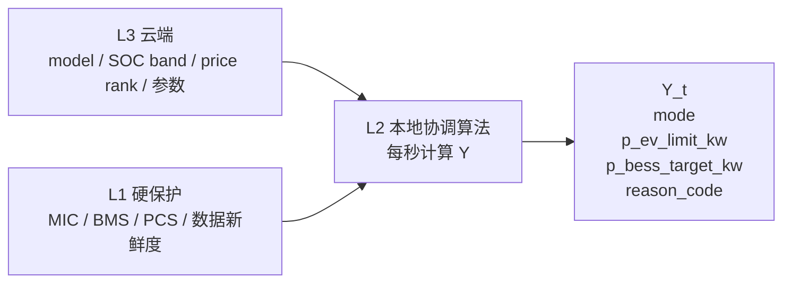
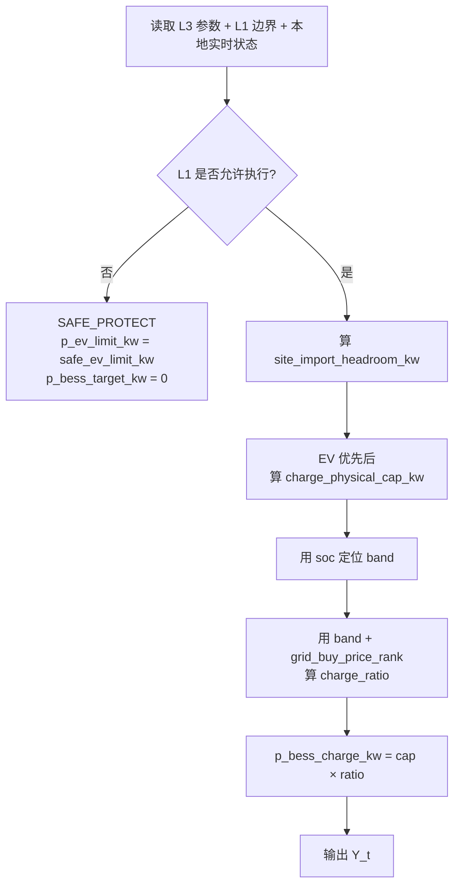

# M1 Model 1 本地算法说明 v0.3

日期：2026-05-28

一句话：

> Model 1 先定义 BESS + EV、Import Only 场景下的本地充电侧调度：L3 云端给 SOC band、价格 rank 和参数，L1 给安全边界并最终限幅，L2 在这些边界内算出 EV 总功率上限和 BESS 目标功率。

---

## 0. 这版怎么来的

这版不是重新发明一套大 EMS，而是把前几版收窄成一个能解释、能测试、能和 IT 对接口的版本。

主要吸收了三件事：

| 来源 | 吸收进 v0.3 的内容 |
|---|---|
| 原始 M1 规则算法 | 保留 `x -> f(x) -> y`，输出仍是四个字段 |
| Ning 的边缘控制策略 draft 02 | 使用 `物理上限 × 使用比例`，避免价格逻辑突破 MIC / PCS 限制 |
| 18:00 讨论 | L1 / L2 / L3 拆成三层；Model 1 只做充电侧经济调度，不实现放电 |

所以这版的核心不是“做一个粗糙 MVP”，而是：

```text
范围要小，但公式要对。
```

---

## 1. Model 1 范围

当前只讨论：

```text
model = M1_BESS_EV_IMPORT_ONLY
```

范围：

```text
BESS + EV
Import Only
无 PV
无 export
无 V2G
```

Model 1 当前要回答三个问题：

1. EV pool 最多允许拿多少功率？
2. BESS 当前是否应该主动充电，充多少？
3. 这个决策的主原因是什么？

Model 1 当前不负责：

| 不负责项 | 原因 |
|---|---|
| L1 安全保护 | MIC / BMS / PCS / SOC / 数据新鲜度保护已有或应由底层系统兜底 |
| 每把枪功率分配 | 我们只输出站级 `p_ev_limit_kw`，每把枪怎么分由 IT / charger 侧做 |
| 原始电价解析 | 云端负责把电价处理成 rank，本地不直接吃 tariff 表 |
| export / V2G | M1 是 Import Only |
| BESS 放电控制 | Model 1 完全不实现放电；放电留给后续模型或独立控制环 |

---

## 2. 三层关系

L1 / L2 / L3 不要理解成一条串行流程，而是三个同时存在的 layer。

| Layer | 人话解释 | 给谁用 | 粒度 |
|---|---|---|---|
| L3 云端 advisory / model layer | 云端提前算好今天/明天的目标和参数 | 给 L2 用 | D+1 计划，30 分钟时间片，每天更新 |
| L2 本地协调 / 经济调度 layer | 本地每秒看现场情况，算本轮目标 | 我们当前算法 | 约 1 秒 |
| L1 hard gate / protection layer | 硬保护，判断能不能动、最多能动多少 | 限制 L2 | 约 500 ms 或设备最快稳定周期 |

关键关系：

```text
L3 给 L2：目标、SOC band、price rank、可调参数
L1 给 L2：安全状态、功率上限、是否可执行
L2 输出：p_ev_limit_kw、p_bess_target_kw、mode、reason_code
```

L1 优先级最高。L2 不能突破 L1 给出的上限。

更准确地说：

```text
L1 不只是前置检查。
L1 也应该在 L2 输出之后做最终 clamp / reject。
```

也就是：

```text
L2 可以算目标，但最终执行前仍要被 L1 的 MIC / BMS / PCS / SOC 限制再检查一遍。
```

---

## 3. 输入 X

M1 v0.3 的输入按三类整理。

### 3.1 X_L3：云端下发参数

这部分是云端给本地的 guidance，不是硬件 command。

| 字段 | 含义 | 粒度 | 是否必需 |
|---|---|---|---|
| `model` | 当前模式，Model 1 用 `M1_BESS_EV_IMPORT_ONLY` | 每次参数包 | 必需 |
| `parameter_version` | 参数包版本，方便回滚和追踪 | 每次参数包 | 建议 |
| `valid_from / valid_to` | 参数包有效期 | 每次参数包 | 必需 |
| `mic_kw` | Maximum Import Capacity，站点允许从电网取电的上限 | 配置 / 云端更新 | 必需 |
| `mic_margin_ratio` | MIC 预留比例，例如 0.05 表示预留 5% | 配置 / 云端更新 | 必需 |
| `soc_p10/p25/p50/p75/p90` | 云端算出的 SOC band 边界 | 30 分钟时间片 | 必需 |
| `grid_buy_price_rank` | 买电价格 rank，0=便宜，1=贵 | 30 分钟时间片 | 必需 |
| `base_charge_ratio_by_soc_band` | 不看价格时，各 SOC band 的基础充电比例 | 参数表 | 必需 |
| `cheap_price_bonus_ratio_by_soc_band` | 电价便宜时，各 SOC band 额外提高的充电比例 | 参数表 | 必需 |

说明：

```text
云端可能还有实际 EV 费用、实际用电成本、预期负荷、预期 EV 充电量、预期 SOC。
这些可以用于复盘、展示和后续模型校验。
但 Model 1 本地公式里，最关键的是 SOC band 和 price rank。
```

如果 `grid_buy_price_rank` 临时缺失但 L3 参数包仍可用，可以用中性默认：

```text
grid_buy_price_rank = 0.5
```

如果 L3 参数包已经过期：

```text
valid_to < current_time -> DATA_STALE
```

如果短期云端只能给 `expected_soc`，可以先临时生成一个简化 band，但 v0.3 推荐目标接口直接使用：

```text
soc_p10, soc_p25, soc_p50, soc_p75, soc_p90
```

### 3.2 X_L1：安全边界和设备能力

这部分来自已有 EMS / BMS / PCS / MIC 保护环。

| 字段 | 含义 | 粒度 | 是否必需 |
|---|---|---|---|
| `hard_gate_ok` | L1 是否允许 L2 下发新目标 | 约 500 ms 或最快稳定周期 | 必需 |
| `data_fresh` | 关键数据是否新鲜 | 约 500 ms 或最快稳定周期 | 必需 |
| `p_bess_charge_cap_kw` | 当前 BESS/PCS/BMS 允许的最大充电功率 | 实时 | 必需 |
| `safe_ev_limit_kw` | 安全异常时 EV pool 的保守上限 | 实时 / 配置 | 必需 |

注意：

```text
L1 不是我们重写的保护算法。
L1 只把“能不能动”和“最多能动多少”给 L2。
```

### 3.3 X_L2：本地实时状态

这部分是现场每秒读到的状态。

| 字段 | 含义 | 粒度 | 是否必需 |
|---|---|---|---|
| `soc` | BESS 当前 SOC，来自 BMS 的确定值 | 约 1 秒 | 必需 |
| `site_base_load_kw` | 站点当前基础负荷，不含本轮 EV 请求，也不含本轮 BESS 目标 | 约 1 秒 | 必需 |
| `site_import_headroom_kw` | 当前电网剩余可用功率，如果 IT 能直接给，可以直接替代 MIC 计算 | 约 1 秒 | 建议 |
| `ev_request_kw` | EV pool 当前请求功率 | 约 1 秒 | 必需 |
| `prev_p_bess_target_kw` | 上一轮 BESS 目标功率 | 约 1 秒 | 建议 |

`site_base_load_kw` 的口径必须和 IT 确认：

```text
不能把 EV_request_kw 已经包含在 site_base_load_kw 里，又在公式里再扣一次 EV_request_kw。
否则会双重扣减 EV。
```

如果站点计量口径复杂，推荐让 IT 直接给：

```text
site_import_headroom_kw
```

这样 L2 就不用自己判断 `site_load` 是否包含 EV / BESS。

---

## 4. 核心数学公式和来源

这一节把 Model 1 的数学逻辑集中放在一起，方便解释“公式是怎么来的”。

Model 1 的公式不是凭空来的，而是由三层约束叠出来的：

| 来源 | 进入公式的方式 |
|---|---|
| L1 安全保护 | 给 `hard_gate_ok`、`data_fresh`、`p_bess_charge_cap_kw`，决定能不能执行、最多能充多少 |
| 站点 import 限制 | 用 `mic_kw`、`mic_margin_ratio`、`site_base_load_kw` 算当前电网余量 |
| L3 云端经济指导 | 用 `soc_p10/p25/p50/p75/p90` 和 `grid_buy_price_rank` 决定可用余量使用比例 |

### 4.1 变量定义

对每个 L2 tick，记作时间点 `t`：

| 数学符号 | 文档字段 | 含义 |
|---|---|---|
| `H_t` | `site_import_headroom_kw` | 当前站点电网可用余量 |
| `M_t` | `mic_kw` | 站点最大 import 上限 |
| `L_t` | `site_base_load_kw` | 站点基础负荷，不含本轮 EV 请求和 BESS 目标 |
| `m_t` | `mic_margin_ratio` | MIC 安全余量比例 |
| `E_t` | `ev_request_kw` | 当前 EV pool 请求功率 |
| `C_t` | `charge_physical_cap_kw` | EV 优先后，BESS 当前可主动充电上限 |
| `B_t` | `band` | 当前 SOC 落在哪个 band |
| `R_t` | `grid_buy_price_rank` | 买电价格 rank，0=便宜，1=贵 |
| `u_t` | `charge_ratio` | 本轮可用充电上限的使用比例 |
| `P_bess,t` | `p_bess_target_kw` | Model 1 输出的 BESS 目标功率 |
| `P_ev_limit,t` | `p_ev_limit_kw` | Model 1 输出的 EV pool 总功率上限 |

### 4.2 公式 1：L1 安全门

```text
if hard_gate_ok_t = false
or data_fresh_t = false
or cloud_packet_expired_t = true:

    P_bess,t = 0
    P_ev_limit,t = safe_ev_limit_kw
    mode_t = SAFE_PROTECT
```

来源：

```text
L1 是硬保护。
只要 L1 不允许，L2 的经济调度没有讨论空间。
```

### 4.3 公式 2：站点电网余量

如果 IT 直接提供 `site_import_headroom_kw`：

```text
H_t = max(0, site_import_headroom_kw_t)
```

如果 IT 不直接提供，则由 MIC 计算：

```text
H_t = max(0, (M_t - L_t) × (1 - m_t))
```

对应字段：

```text
H_t = site_import_headroom_kw
M_t = mic_kw
L_t = site_base_load_kw
m_t = mic_margin_ratio
```

来源：

```text
MIC 是站点最多能从电网拿多少。
site_base_load 是已经被站点基础负荷占掉的部分。
margin 是为了不顶到 MIC 留出来的安全余量。
```

### 4.4 公式 3：EV 优先后的 BESS 可充上限

```text
C_t = max(0, min(
    H_t - E_t,
    p_bess_charge_cap_kw_t
))
```

对应字段：

```text
C_t = charge_physical_cap_kw
H_t = site_import_headroom_kw
E_t = ev_request_kw
```

来源：

```text
Model 1 默认 EV 优先。
EV 当前请求先占用电网余量。
剩下的余量才允许 BESS 主动充电。
同时，BESS 充电不能超过 L1 给出的当前最大可充功率。
```

### 4.5 公式 4：SOC band 定位

```text
if   soc_t < soc_p10_t: B_t = 0
elif soc_t < soc_p25_t: B_t = 1
elif soc_t < soc_p50_t: B_t = 2
elif soc_t < soc_p75_t: B_t = 3
elif soc_t < soc_p90_t: B_t = 4
else:                   B_t = 5
```

来源：

```text
云端给 SOC band 边界。
本地只拿当前确定的 SOC 去判断它落在哪一档。
SOC 越低，越倾向主动充电。
SOC 越高，越不主动充电。
```

### 4.6 公式 5：SOC + 电价决定充电比例

```text
base_t = base_charge_ratio_by_soc_band[B_t]

price_bonus_t =
    cheap_price_bonus_ratio_by_soc_band[B_t] × (1 - R_t)

u_t = clip(base_t + price_bonus_t, 0, 1)
```

两端 band 可以固定：

```text
if B_t = 0: u_t = 1
if B_t = 5: u_t = 0
```

来源：

```text
这是 Ning draft 02 的核心思路：
先算物理上限，再算使用比例。

电价只影响比例 u_t。
电价不会额外创造 kW。
所以不会突破 MIC / BMS / PCS 的物理限制。
```

如果 `grid_buy_price_rank` 暂时缺失：

```text
R_t = 0.5
```

也就是用中性价格，不偏向“多充”也不偏向“少充”。

### 4.7 公式 6：BESS 目标功率

```text
P_bess,t = C_t × u_t
```

最终执行前，L1 再限幅：

```text
P_bess,t = clamp(
    P_bess,t,
    0,
    p_bess_charge_cap_kw_t
)
```

来源：

```text
Model 1 只做充电侧调度。
所以 P_bess,t 只能是正数或 0。
不输出负数。
```

### 4.8 公式 7：EV pool 上限

```text
P_ev_limit,t = min(E_t, H_t)
```

来源：

```text
Model 1 不用 BESS 放电支援 EV。
所以 EV pool 最多只能拿当前电网可用余量。
如果 EV 请求小于余量，就满足 EV 请求。
如果 EV 请求大于余量，就限制到余量。
```

### 4.9 最终输出

```js
Y_t = {
  mode_t,
  p_ev_limit_kw: P_ev_limit,t,
  p_bess_target_kw: P_bess,t,
  reason_code_t
}
```

其中：

```text
p_bess_target_kw >= 0
```

---

## 5. 算法步骤 f(X)

### 5.1 先看 L1 是否允许执行

```text
if hard_gate_ok == false or data_fresh == false or cloud packet expired:
    mode = SAFE_PROTECT
    p_ev_limit_kw = safe_ev_limit_kw
    p_bess_target_kw = 0
```

这一步的人话是：

```text
安全不过，本地经济调度不参与争论，直接保守。
```

### 5.2 计算站点可用电网余量

如果 IT 直接给电网余量，优先直接用：

```text
site_import_headroom_kw = max(0, IT_provided_site_import_headroom_kw)
```

如果 IT 不直接给余量，则本地可用下面公式计算：

```text
site_import_headroom_kw = max(
    0,
    (mic_kw - site_base_load_kw) * (1 - mic_margin_ratio)
)
```

人话：

```text
MIC 是电网最多让站点拿多少电。
site_base_load 是站点基础负荷已经用了多少。
margin 是安全余量。
扣完以后，剩下的就是 EV + BESS 可以共享的电网余量。
```

如果使用 kW 余量写法，也可以等价写成：

```text
site_import_headroom_kw = max(0, mic_kw - mic_margin_kw - site_base_load_kw)
```

两种方式二选一，不要同时用。

### 5.3 EV 优先后的 BESS 可充上限

```text
charge_physical_cap_kw = max(
    0,
    min(
        site_import_headroom_kw - ev_request_kw,
        p_bess_charge_cap_kw
    )
)
```

人话：

```text
Model 1 默认 EV 优先。
EV 当前请求先占用 headroom。
剩下的 headroom 才允许 BESS 主动充电。
```

所以：

```text
EV 满载、没有剩余 headroom -> BESS 主动充电为 0
EV 不满载、有剩余 headroom -> BESS 可以按经济策略充电
```

### 5.4 定位 SOC band

```text
if   soc < soc_p10: band = 0
elif soc < soc_p25: band = 1
elif soc < soc_p50: band = 2
elif soc < soc_p75: band = 3
elif soc < soc_p90: band = 4
else:               band = 5
```

人话：

```text
SOC band 不是安全边界。
它是云端根据预测给本地的运行区间。
SOC 越低，越倾向充电。
SOC 越高，越不倾向主动充电。
```

### 5.5 根据 SOC band 和价格 rank 算充电比例

定义：

```text
base = base_charge_ratio_by_soc_band[band]
price_bonus = cheap_price_bonus_ratio_by_soc_band[band] * (1 - grid_buy_price_rank)
charge_ratio = clip(base + price_bonus, 0, 1)
```

其中：

```text
grid_buy_price_rank = 0  -> 买电便宜 -> price_bonus 最大
grid_buy_price_rank = 1  -> 买电贵   -> price_bonus 为 0
```

两端 band 可以固定处理：

```text
if band == 0:
    charge_ratio = 1
if band == 5:
    charge_ratio = 0
```

这一步最重要的原则是：

```text
价格只改变“可用余量用多少比例”。
价格不会额外创造 kW，也不能突破 MIC / L1 cap。
```

### 5.6 计算 BESS 充电目标

```text
p_bess_charge_kw = charge_physical_cap_kw * charge_ratio
```

如果本轮只做充电侧经济调度：

```text
p_bess_target_kw = p_bess_charge_kw
```

约定：

```text
p_bess_target_kw > 0  表示 BESS 充电
p_bess_target_kw = 0  表示 BESS 不动
p_bess_target_kw < 0  不在 Model 1 输出
```

最终执行前，L1 仍要再做一次限幅：

```text
p_bess_target_kw = clamp(
    p_bess_target_kw,
    0,
    p_bess_charge_cap_kw
)
```

### 5.7 计算 EV pool 上限

```text
p_ev_limit_kw = min(
    ev_request_kw,
    site_import_headroom_kw
)
```

人话：

```text
Model 1 不用 BESS 放电支援 EV。
EV 最多拿到当前电网可用余量。
```

---

## 6. 输出 Y

输出固定保持四个字段：

```js
Y_t = {
  mode,
  p_ev_limit_kw,
  p_bess_target_kw,
  reason_code
}
```

| 字段 | 含义 |
|---|---|
| `mode` | 当前策略状态 |
| `p_ev_limit_kw` | EV pool 最大允许功率，也就是 `P_gun_pool_max` |
| `p_bess_target_kw` | BESS 目标功率，Model 1 中正数充电、0 不动，不输出负数 |
| `reason_code` | 当前主原因 |

### 6.1 mode 判断

主状态优先级：

```text
SAFE_PROTECT > EV_LIMIT > BESS_CHARGE > NORMAL
```

如果 EV 拿不到请求功率，主状态显示 `EV_LIMIT`。

```text
if hard_gate_ok == false or data_fresh == false or cloud packet expired:
    mode = SAFE_PROTECT

elif p_ev_limit_kw < ev_request_kw:
    mode = EV_LIMIT

elif p_bess_target_kw > 0:
    mode = BESS_CHARGE

else:
    mode = NORMAL
```

### 6.2 reason_code 判断

第一版 reason 只输出主原因：

```text
if hard_gate_ok == false:
    reason_code = BESS_FAULT
elif data_fresh == false:
    reason_code = DATA_STALE
elif cloud packet expired:
    reason_code = DATA_STALE
elif p_ev_limit_kw < ev_request_kw:
    reason_code = MIC_LIMIT
elif band == 0 or band == 1:
    reason_code = SOC_LOW
else:
    reason_code = NORMAL
```

如果 L1 能提供更细的错误来源，后续可以把 `BESS_FAULT` 拆成：

```text
PCS_LIMIT
BMS_LIMIT
SOC_LIMIT
```

---

## 7. 流程图

### 7.1 三层交互图



### 7.2 L2 本地计算图



---

## 8. 这版刻意不放进主公式的东西

| 暂不放进主公式 | 原因 |
|---|---|
| 原始电价表 | 本地只吃云端处理后的 rank |
| export sell price | M1 无 export |
| BESS 放电控制 | Model 1 完全不需要，留给后续模型或独立控制环 |
| 每把枪分配 | 我们只输出 `P_gun_pool_max` |
| site load EMA / EV gap hysteresis | 属于实现抗抖细节，不作为 v0.3 主模型口径 |
| `allow_buy_grid` | 用 `model` 表示场景，不再单独放一个容易混淆的开关 |

---

## 9. 需要继续确认的问题

| 问题 | 当前建议 |
|---|---|
| MIC 是云端下发还是本地配置？ | 两种都支持，但要选一个主口径 |
| `mic_margin_ratio` 默认值是多少？ | 先不要写死，等 Ning / IT 定 |
| SOC band 是否能直接由云端模型输出？ | 目标接口按 band 设计；短期可用 expected SOC 临时转换 |
| `base_charge_ratio_by_soc_band` / `cheap_price_bonus_ratio_by_soc_band` 谁定？ | 云端 / Ning 调参，L2 只消费 |
| IT 是否接受 Model 1 的 `p_bess_target_kw >= 0` 约定？ | 当前 Model 1 不输出负数 |
| `site_base_load_kw` 口径怎么定？ | 必须确认是否排除 EV / BESS；否则优先让 IT 给 `site_import_headroom_kw` |

---

## 10. 对外口径

可以这样说：

> Model 1 v0.3 只定义 Import Only、BESS + EV 场景下的本地充电侧调度：L3 下发模型参数和价格/SOC 指导，L1 提供硬保护边界并最终限幅，L2 在这些边界内计算 EV pool limit 和 BESS 充电目标。Model 1 完全不实现 BESS 放电，`p_bess_target_kw` 只会是正数或 0。
