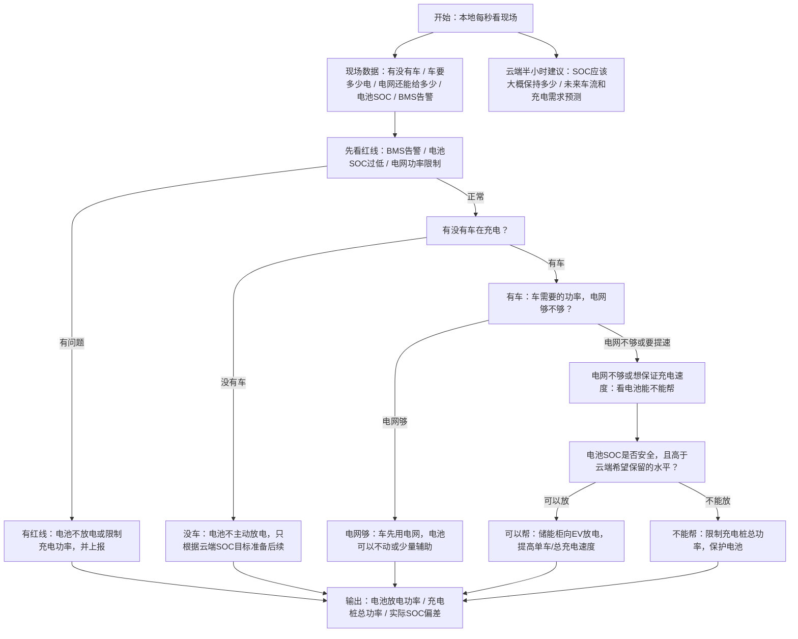

# 第一版场景：负荷 + 充电桩 + 储能调度

日期：2026-05-25

用途：根据最新会议纪要整理第一版实际要做的范围。这个版本比 PPT 里的完整光储充逻辑更窄，适合三周内先打通框架。

## 1. 最新结论

第一版不要先做完整光伏场景。

当前三个场站基本都可以当作“无光伏可用”：

- 两个场站没有光伏；
- 第三个场站虽然有光伏，但接入还需要时间；
- 所以第一版按无光伏场景处理。

第一版核心场景是：

> 负荷 + 充电桩 + 储能柜。储能柜只给电动车放电，不向电网卖电，也不向普通站内负荷放电。

## 2. 第一版本地逻辑要回答的问题

本地算法先回答一个最小问题：

> 有车来充电时，储能柜要不要帮这台车放电？帮多少？什么时候不帮？

不是先回答：

- 怎么卖电；
- 怎么光伏消纳；
- 怎么给站内负荷放电；
- 怎么做 12 种完整模型。

## 3. 第一版输入

本地需要看的输入：

- 当前有没有车来充电；
- 每台车当前需要多少充电功率；
- 站点电网可用功率；
- 储能柜当前 SOC；
- 储能柜最大可放电功率；
- BMS 是否报警；
- 云端半小时一次给的 SOC guidance；
- 云端/模拟器给的未来车流和充电需求预测。

云端或上层需要准备的输入：

- 充电需求预测；
- 负荷预测；
- 电价接口，包括客户原电价和法电合同电价；
- 未来半小时粒度的 SOC guidance，例如 p10 / p50 / p90。

## 4. 第一版输出

本地输出：

- 储能柜是否放电；
- 储能柜给 EV 放多少功率；
- 如果电网和储能都不够，充电桩总功率如何限制；
- 实际 SOC 和云端 SOC guidance 的偏差。

云端输出：

- 半小时粒度 SOC guidance；
- 给 IT 或本地侧使用的接口数据。

## 5. 第一版主逻辑图

## 6. 第一版几个例子

### 例子 A：车来了，电网够，电池不用帮

现场：

- 车需要 80 kW；
- 电网当前还能提供 120 kW；
- 电池 SOC 正常。

动作：

- 车主要用电网充；
- 储能柜可以不放电；
- 本地只记录 SOC 和充电情况。

### 例子 B：车来了，电网不够，电池 SOC 高

现场：

- 车需要 150 kW；
- 电网当前只能提供 100 kW；
- 电池 SOC = 80%；
- BMS 没报警。

动作：

- 电网给 100 kW；
- 储能柜放电补 50 kW；
- 车尽量维持目标充电速度。

### 例子 C：车来了，电网不够，但电池 SOC 太低

现场：

- 车需要 150 kW；
- 电网当前只能提供 100 kW；
- 电池 SOC = 12%；
- 云端希望保留 SOC。

动作：

- 储能柜不放电；
- 充电桩总功率限制到电网可承受范围；
- 保护电池优先。

### 例子 D：没车，云端预测半小时后有高峰

现场：

- 当前没车；
- 电池 SOC = 35%；
- 云端预测后面会有车流高峰；
- 云端 SOC guidance 希望电池更高。

动作：

- 本地不主动放电；
- 是否从电网提前充电，要看云端和接口是否允许；
- 第一版本地重点是记录和准备，不做复杂套利。

### 例子 E：BMS 报警

现场：

- 有车；
- 电池 SOC 够；
- 但 BMS 报警。

动作：

- 储能柜不放电；
- 车只用电网能给的功率；
- 必要时限制充电桩总功率并上报。

## 7. Leo 的任务变成什么

Leo 现在不是先画完整光储充大图，而是先做三件事：

1. 车流量模拟
   - 基于 33 个场站，先确认具体场站信息；
   - 其中 11 个在伦敦，另外两个场站需要再确认；
   - 模拟不同时间段来车概率。

2. 充电需求预测
   - 预测未来每半小时大概会有多少充电需求；
   - 初期不准也可以，重点是先有接口和数据流。

3. 本地算法优化方向
   - 第一版先围绕“保证单车充电速度”或“减少充电降额”思考；
   - 写出简单逻辑图或数学框架；
   - 明天和 Ning 讨论后再聚焦成一两个优化目标。

## 8. 第一版和 PPT 完整版的关系

PPT 完整版包含：

- 光伏；
- 储能充电；
- 储能放电给 EV / 负荷 / 电网；
- 卖电套利；
- 灰度上线；
- 未来 12 种模型扩展。

第一版先只做：

- 无光伏；
- 有车流和充电需求；
- 储能只向 EV 放电；
- 云端给 SOC guidance；
- 本地根据实时来车和电池状态决定是否放电帮车。

一句话：

> 第一版不是完整光储充优化，而是先打通“充电需求预测 -> 云端 SOC guidance -> 本地储能辅助 EV 充电”的最小闭环。

