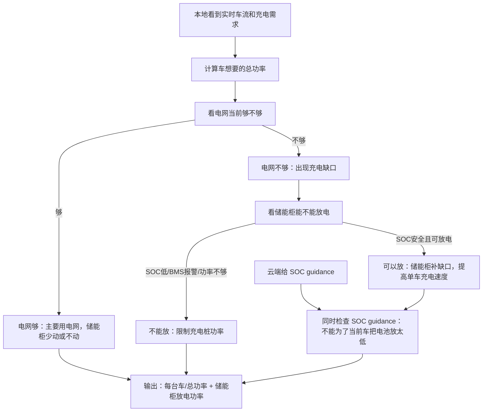

# 本地算法优化维度发散稿

日期：2026-05-25

用途：明天和 Ning 讨论。这个文件不是最终算法，而是先把“本地算法可以优化什么”列出来，再建议第一版先聚焦一两个维度。

## 1. 问题重新定义

云端给 SOC guidance，本地看到实时来车和现场功率限制后，需要决定：

> 储能柜这一秒要不要给 EV 放电？放多少？如果不够，充电桩总功率怎么降？

所以本地算法的核心不是“跟 SOC 曲线”本身，而是在多个目标之间做取舍。

## 2. 可优化维度

| 维度 | 想优化什么 | 简单解释 | 第一版是否适合 |
|---|---|---|---|
| 单车充电速度 | 让正在充的车尽量拿到它想要的功率 | 用户最直接感知：插上后速度够不够快 | 适合，建议主目标 |
| 全站充电吞吐 | 同一时间让整个站尽量多输出 kWh | 站点整体服务能力和收入 | 适合，作为辅助目标 |
| 公平性 | 多台车同时来时，不要一台车吃满，另一台车太低 | 避免用户体验差异太大 | 可做简单规则，不必第一版复杂化 |
| 电网容量保护 | 不超过站点电网接入功率 | 电网不够时，要靠储能补或限制桩功率 | 必须作为约束 |
| SOC 保留 | 不要把电池放太低，给后面来车留能力 | 云端 SOC guidance 的意义之一 | 适合，作为硬/软约束 |
| 电池寿命 | 少做没必要的循环，避免频繁充放 | 保护储能柜寿命 | 第一版先简单限制，不做主目标 |
| 成本/电价 | 贵电少买，便宜电多用 | 云端更适合做，本地不宜复杂化 | 第一版不作为本地主目标 |
| 排队/等待时间 | 车多时减少等待 | 需要排队和车位数据 | 暂不做 |

## 3. 第一版建议聚焦

第一版建议只选两个：

1. 主目标：保证单车充电速度。
2. 约束目标：不把 SOC 放穿，保留后续服务能力。

一句话：

> 在不违反电池安全和 SOC guidance 的前提下，用储能柜尽量补足电网不足，让正在充的车速度不要掉太多。

## 4. 简单数学框架

先定义几个量：

- `P_req_i`：第 i 台车想要的充电功率。
- `P_ev_i`：第 i 台车实际拿到的充电功率。
- `P_grid_avail`：电网当前可用于充电的功率。
- `P_bess_dis`：储能柜当前放电功率。
- `P_bess_max`：储能柜最大可放电功率。
- `SOC_now`：当前电池 SOC。
- `SOC_ref`：云端给的 SOC 参考。
- `SOC_min_local`：本地不希望低于的 SOC 保留线。

第一版目标可以写成：

```text
尽量最小化：所有车的充电缺口

缺口 = 车想要的功率 - 实际拿到的功率
```

更具体一点：

```text
minimize Σ max(0, P_req_i - P_ev_i)
```

约束：

```text
Σ P_ev_i <= P_grid_avail + P_bess_dis
0 <= P_bess_dis <= P_bess_max
SOC_now 不能低于 SOC_min_local
如果 SOC_now 已经低于 SOC_ref，不要轻易放电
BMS 报警时 P_bess_dis = 0
```

## 5. 逻辑图版本



## 6. 几个维度对应的例子

### 例子 1：单车速度维度

现场：

- 一台车想要 150 kW；
- 电网只能给 100 kW；
- 电池 SOC 足够。

策略：

- 储能柜补 50 kW；
- 这台车尽量维持 150 kW。

这就是优化单车充电速度。

### 例子 2：SOC 保留维度

现场：

- 一台车想要 150 kW；
- 电网只能给 100 kW；
- 电池 SOC 已经低于云端参考。

策略：

- 不一定补满 50 kW；
- 可能只补 20 kW，或者不补；
- 牺牲一点当前车速，保留电池能力。

这就是单车速度和 SOC 保留之间的权衡。

### 例子 3：多车公平维度

现场：

- 两台车各想要 100 kW；
- 电网加储能一共只能给 150 kW。

策略候选：

- 方案 A：一台 100 kW，另一台 50 kW；
- 方案 B：两台各 75 kW。

如果优化公平性，就更偏向方案 B。

### 例子 4：全站吞吐维度

现场：

- 多台车同时充；
- 电池 SOC 足够；
- 电网接近上限。

策略：

- 储能柜补电网不足；
- 让全站总输出 kWh 更高。

这就是优化全站吞吐。

## 7. 明天可以给 Ning 的说法

> 我理解本地算法不是只画固定流程，而是要先定义优化维度。现在我先发散了几个维度：单车充电速度、全站吞吐、公平性、电网容量保护、SOC 保留、电池寿命和成本。其中第一版我建议聚焦“单车充电速度”作为主目标，同时用 SOC guidance 做约束，避免为了当前车把电池放太低。数学上可以先写成最小化充电缺口：车想要的功率和实际拿到功率之间的差值。

