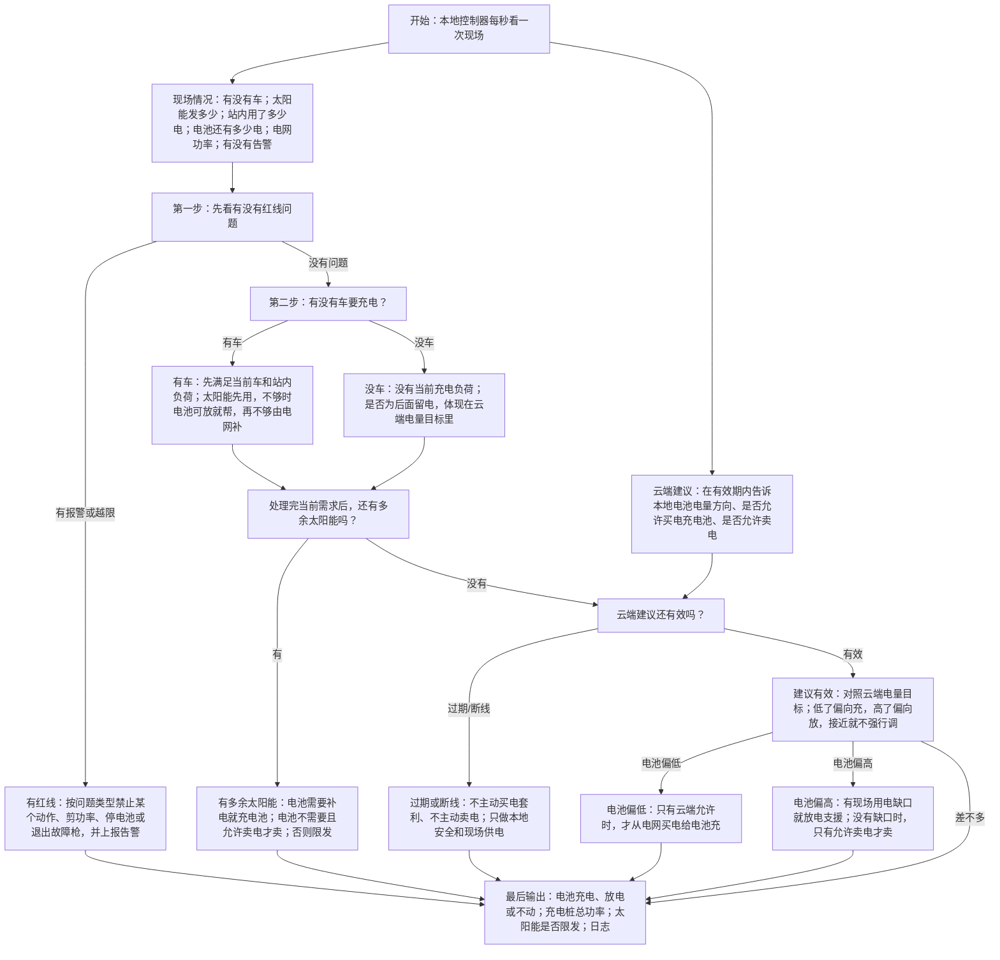

# 光储充本地控制逻辑 V1

日期：2026-05-25

这个版本用于第一轮沟通：以 PPT 原逻辑为主，加一点我们自己的理解，让它更容易讲清楚。

V1 的定位：

- 先讲清 PPT，不展开复杂工程细节。
- 先回答“储能柜什么时候充、什么时候放、什么时候不动”。
- 先用于和 Ning 对齐理解，不作为最终工程控制方案。
- 专家扩展问题放到 V2，不放进第一轮解释。

## 1. 一句话

云端给电池 SOC 参考方向，本地 EMS 根据现场情况自己判断：储能柜现在该充电、放电，还是不动。

我们的理解是：这不是“充电桩自己判断充不充电”，而是一个快充站的本地控制器在判断储能柜怎么配合充电桩、光伏和电网。

## 2. 系统里有什么

- EV 充电桩：车来了就要电。
- 光伏 PV：白天发电。
- 储能柜 BESS：可以充电，也可以放电。
- 电网：不够电时买电，多余电时可以卖电。
- 本地 EMS：现场控制器，负责实时判断。
- 云端模型：负责算 SOC 参考曲线，告诉本地电池电量大概应该往哪里走。

## 3. 云端和本地怎么分工

云端做：

- 看电价、天气、负荷预测。
- 算一个 SOC 参考曲线或 SOC 区间。
- 告诉本地能不能买电充电、能不能卖电。

本地做：

- 看现场有没有车。
- 看光伏现在发多少。
- 看储能柜 SOC 多少。
- 看站内负荷和电网限制。
- 决定储能柜充电、放电，还是不动。
- 如果有报警或越限，先保护设备。

一句话：云端负责“理想上怎么更划算”，本地负责“现场这一秒怎么安全执行”。

我们的补充理解：

- 云端像总部：看电价、天气、预测，给一个大方向。
- 本地像店长：车来了、太阳变了、电池报警了，都要现场立即处理。
- SOC 目标不是死命令，只是“尽量往这个方向靠”。
- 如果赚钱目标和现场安全冲突，本地先保安全。

## 4. PPT 的 A/B/C/D 规则

### A. 储能柜什么时候放电

优先级：

1. 先支援 EV 充电。
2. 再支援站内 AC 负荷。
3. 最后才考虑卖电。

简单理解：有车来了，电池先帮车，不是先卖电赚钱。

### B. 储能柜什么时候充电

优先级：

1. 先用多余光伏给电池充电。
2. 如果云端允许，并且适合从电网买电，再从电网充电。

简单理解：免费的太阳能先存起来；从电网买电要云端允许。

### C. 光伏电怎么用

优先级：

1. 先给 EV 充电。
2. 再给站内负荷。
3. 剩下的太阳能进入“余电处理”：电池需要补 SOC 就充电池；电池不需要补、且云端允许卖电时才卖电；都不合适就限发。

简单理解：太阳能先服务现场；余电到底存进电池还是卖出去，要看电池 SOC 和云端许可，不要在图里写成两个互相打架的固定顺序。

### D. 硬限制

这些比赚钱和 SOC 目标更重要：

- 电池不能过充、过放。
- BMS 告警要停或降级。
- 电网进出功率不能超限制。
- 充电桩故障要处理。

简单理解：安全和设备限制永远优先。

## 5. 主逻辑图

这张图里：

- “太阳能”就是 PPT 里的 PV。
- “车”就是 PPT 里的 EV。
- “电池电量”就是 SOC。
- “红线问题”就是 PPT 里的 D 硬限制。
- 关键顺序是：先看红线，再看有没有车；先满足当前车和站内负荷，处理完当前需求后，再看多余太阳能和云端 SOC 目标。
- 不要理解成电池可以同一时刻一边帮车放电、一边又从电网充电；本地图表达的是判断优先级。

## 6. 几个具体场景

### 场景 1：早上没车，电池低，电价便宜

本地判断：

- 没有车要充。
- 电池 SOC 比云端希望的低。
- 云端建议有效，并且允许从电网买电。

动作：

- 储能柜从电网充电。

### 场景 2：中午太阳很好，有车充电

本地判断：

- 光伏发电很多。
- 有车需要充电。

动作：

- 光伏先给车。
- 再给站内负荷。
- 如果还有多余，看电池 SOC：电池需要补电就充电池；电池不需要补且允许卖电时才卖。

### 场景 3：傍晚太阳没了，车很多，电池电量高

本地判断：

- 车需要很多电。
- 光伏没有了。
- 电池 SOC 比云端目标高。

动作：

- 如果电池没有触碰安全下限，储能柜放电，帮 EV 和站内负荷。
- 不够的部分再从电网买。

### 场景 4：晚上没车，电池高，云端允许卖电

本地判断：

- 没有车。
- 电池 SOC 高。
- 云端允许卖电。

动作：

- 电池可以放电，先供站内负荷，多余再卖电。

### 场景 5：电池快没电，但车来了

本地判断：

- 车要电。
- 但电池 SOC 太低。

动作：

- 电池不再放电。
- 车尽量从电网取电。
- 如果电网功率不够，就限制充电桩总功率。
- 原因是站点接入电网有最大功率限制，不能无限从电网取电。

### 场景 6：设备报警或电网超限

本地判断：

- BMS 告警，或者电网功率超限。

动作：

- 不管云端 SOC 怎么建议，先处理红线。
- 如果是 BMS 告警，可能要停电池。
- 如果是电网功率超限，优先限充电桩总功率、调整电池或太阳能功率，不一定整站停。

### 场景 7：太阳很好，没车，电池快满

本地判断：

- 没有车。
- 光伏发电很多。
- 电池 SOC 已经很高。
- 云端允许卖电。

动作：

- 光伏不用给车。
- 站内负荷先用掉一部分。
- 电池不适合继续充时，多余光伏可以卖电。
- 如果不允许卖电，就限发。

### 场景 8：云端建议过期

本地判断：

- 云端上一次建议已经过期，或者云端断线。
- 本地仍然能看到车、光伏、电池、电网和告警。

动作：

- 本地继续安全运行。
- 有车就尽量服务车。
- 有多余光伏仍可给电池充。
- 但不主动从电网买电套利，也不主动卖电套利。

## 7. 你可以怎么解释给 Ning

可以这样说：

> 我先按 PPT 原逻辑整理成 V1，不额外扩展复杂工程问题。我的理解是：云端只给 SOC 参考和买卖电许可，本地按 A/B/C/D 跑。A 是电池放电优先级，B 是电池充电优先级，C 是光伏使用优先级，D 是硬约束。SOC 不是必须精确命中，只是在安全和现场需求允许的情况下尽量靠近。

## 8. V1 暂时不展开的内容

以下内容先不放进主图，避免图太复杂：

- G99/G100 并网保护细节。
- BMS/PCS 详细故障状态机。
- EV 单枪功率分配算法。
- 电池寿命和循环成本。
- shadow mode KPI 细节。

这些放到 V2 专家理解版，作为下一轮工程评审问题，不影响 V1 先讲清 PPT。
