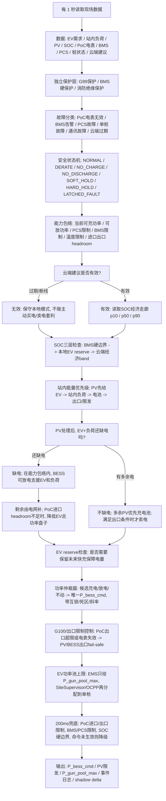

# 光储充本地控制逻辑 V2：专家理解版

日期：2026-05-25

用途：在 V1 的基础上，加入专家评审视角。这个版本不适合第一轮口头解释，主要作为工程风险备忘和下一轮讨论材料。

V2 吸收了三类评审视角：

- 电网/DNO：并网、进口/出口限制、G99/G100、PoC 计量。
- 储能柜/BMS/PCS：SOC 边界、BMS 告警、PCS 能力、充放电互锁。
- 快充运营：EV 功率池、OCPP/SiteSupervisor 边界、用户体验和灰度上线。

它仍然不是最终代码，只是把 V1 里容易被专家抓住的问题补上。

核心问题：

> 在英国一个带光伏、储能柜和 EV 快充桩的站点里，本地控制器如何判断储能柜现在该充电、放电，还是不动？

## 1. 一句话理解

云端告诉本地：“电池电量最好大概往哪里走”。本地看现场真实情况，能跟就跟；但并网限制、设备安全、车要充电、电池寿命和现场可用率永远优先。

## 2. V2 相比 V1 的修正点

相比 V1，这版补了 7 个关键点：

1. 进口和出口分开
   - `MIC` 只作为进口容量理解。
   - 出口限制单独写成 `MEC / agreed export limit / G100 export limit`。
   - 所有动作最终都要过 PoC 并网点净功率限制。

2. SOC 分三层
   - 第一层：BMS 硬边界，越界就停或禁止充/放。
   - 第二层：本地运行保留边界，例如给 EV 高峰保留电量。
   - 第三层：云端经济 SOC band，也就是 `p10 / p50 / p90`，只作为软目标。

3. 增加能力包络
   - 每次判断前先算当前储能柜到底还能充多少、放多少。
   - 受 PCS、BMS、温度、SOC、电芯状态、并网余量共同限制。

4. 增加功率仲裁器
   - 不允许同一时刻既充又放。
   - 所有候选动作最后统一成一个 `P_bess_cmd`。

5. G99/G100 和 EMS 边界分开
   - G99 并网保护不是 EMS 策略的一部分。
   - G100/出口限制需要故障安全逻辑，不能只当普通限幅。

6. EV 总功率盘子只由 EMS 给上限
   - EMS 输出的是 `P_gun_pool_max`。
   - 每把枪怎么分，由 SiteSupervisor/OCPP 侧处理。
   - 降额要有最低保障、斜率和恢复规则，避免用户体验抖动。

7. 故障不一刀切
   - BESS 故障、单桩故障、PoC 电表故障、云端断线、PCS 通讯故障要分开处理。
   - 能局部降级就局部降级，不默认整站停。

## 3. 先采用的默认规则

以下默认值直接按 PPT 理解，并加入合理工程约束。

1. 云端给什么
   - 采用 PPT 的 `SOC band`：`p10 / p50 / p90`。
   - `p50` 是理想方向，不要求精确命中。
   - `p10-p90` 是经济运行走廊，不是电池保护线。

2. 本地怎么跟 SOC
   - 先守 BMS 硬边界。
   - 再守本地 reserve，例如给未来 EV 高峰保留的最低 SOC。
   - 最后才参考云端 `p10 / p50 / p90`。
   - SOC 在 `p10-p90` 里面：正常运行，不强行追精确目标。
   - SOC 低于 `p10`：偏向充电，避免非必要放电。
   - SOC 高于 `p90`：可以偏向放电或卖电，但必须先满足 EV reserve、站内负荷、并网限制和寿命保护。

3. 什么时候能从电网买电给电池充
   - 光伏多出来的电，本地可以直接给电池充。
   - 从电网买电给电池充，必须同时满足：
     - `allow_buy_grid = true`；
     - EV 和站内负荷已满足；
     - PoC 进口还有足够 headroom；
     - 不违反 BMS/PCS 当前充电能力；
     - 不违反寿命/循环限制。
   - 云端建议过期后，不主动做“买便宜电充电池”的套利动作。

4. 什么时候能卖电
   - 卖电必须同时满足：
     - DNO/并网侧允许出口；
     - G99/G100/出口限制控制链路健康；
     - `allow_sell = true`；
     - EV 和站内负荷已满足；
     - 已保留未来 EV 保障电量；
     - PoC 出口没有超过 `MEC / agreed export / G100 limit`；
     - 不违反 BMS/PCS 当前放电能力和寿命限制。
   - `allow_sell = true` 只是商业许可，不等于并网许可。

5. 云端断线怎么办
   - 继续本地保守运行。
   - 保留：服务车、用光伏、保护电池、守进口/出口限制。
   - 暂停：主动买电套利、主动卖电套利。

6. 时间节奏
   - 云端大概 30 分钟给一次建议。
   - 本地大概每 1 秒做一次正常判断。
   - 安全和并网限制大概每 200 毫秒检查一次。
   - 超限不能只“检查”，还要验证动作是否生效；如果持续超限，则进入 SOFT/HARD HOLD。

## 4. 主逻辑图

## 5. 储能柜什么时候充 / 放 / 不动

| 现场情况 | 储能柜动作 | 必须先满足的限制 |
|---|---|---|
| 有车充电，PV 不够，SOC 高于本地 reserve | 放电支援 EV 和站内负荷 | BMS 允许放电，PCS 有能力，PoC 进口/出口不越限 |
| 有车充电，但 SOC 接近本地 reserve 或硬下限 | 不放电 | 保护电池和未来 EV 保障电量 |
| PV 大于 EV + 站内负荷，SOC 未高 | 充电 | BMS 允许充电，PCS 有能力，温度正常 |
| PV 多，SOC 高，且并网和商业都允许出口 | 可以出口或限发 | DNO/G100 允许，`allow_sell=true`，PoC 出口有 headroom |
| 没车，电价便宜，SOC 低，云端允许买电 | 从电网充电 | EV/负荷优先，进口 headroom 足够，BMS/PCS 可充，寿命约束允许 |
| 没车，电价贵，SOC 高，云端允许卖电 | 放电卖电 | 保留 EV reserve，出口许可健康，寿命约束允许 |
| 云端建议过期 | 只做保守自用逻辑 | 不主动买电套利，不主动卖电套利 |
| BMS/PCS 硬故障、消防/绝缘故障 | 停或锁存故障 | HARD_HOLD/LATCHED_FAULT，不能自动恢复 |
| PoC 电表无效或出口限制控制失效 | 停止主动出口 | 进入 fail-safe，PV/BESS 出口降到 0 或批准安全值 |

## 6. EV 功率池规则

EMS 不直接决定每把枪给多少电。EMS 只输出站级总盘子 `P_gun_pool_max`，然后交给 SiteSupervisor/OCPP 分配。

建议默认规则：

1. 先保证已插枪会话的最低服务功率。
2. 再按车辆可接收功率、会话阶段、充电时长和桩能力分配。
3. 降额要按斜率下降，不要瞬间把单枪打到很低。
4. 恢复功率要有滞回，避免上下抖动。
5. 高 SOC、已经进入 taper 阶段的车辆可以优先让出部分功率。
6. 单桩故障只隔离单桩，释放对应功率，不默认全站降额。

## 7. 故障降级规则

| 故障类型 | 默认动作 |
|---|---|
| 云端建议过期 | 保守本地模式；禁用主动买电/卖电套利 |
| PoC 电表无效 | 停止主动出口；进口侧采用保守上限；持续异常进入 HOLD |
| G100/出口限制链路异常 | PV/BESS 出口 fail-safe 到 0 或 DNO 批准安全值 |
| BMS 二级/轻告警 | 降额或禁止某一方向充/放 |
| BMS 一级告警 | 停 BESS，进入 HARD_HOLD |
| 消防/绝缘/接触器硬故障 | LATCHED_FAULT，禁止自动恢复 |
| PCS 通讯失败或命令未生效 | 命令归零并验证；失败则 HOLD |
| 单桩故障 | 隔离单桩，其余继续 |
| 多桩或 SiteSupervisor 失联 | 降低 EV 总功率盘子或进入站级降级模式 |

## 8. 用几个例子验证逻辑

### 例子 A：早上，电价便宜，没车，电池低

现场：
- SOC = 30%
- 云端经济区间：p10 = 45%，p50 = 60%，p90 = 75%
- 没有车
- PV 很少
- `allow_buy_grid = true`
- PoC 进口 headroom 足够

动作：
- 储能柜从电网充电。
- 但充电功率不能超过 BMS/PCS 当前可充能力，也不能挤占 EV reserve 或进口容量。

### 例子 B：中午，太阳很好，有车在充

现场：
- PV = 120 kW
- 车需要 = 100 kW
- 站内负荷 = 10 kW
- SOC 在正常区间

动作：
- PV 先给车。
- 再给站内负荷。
- 多出来的给电池充电。
- 如果电池不能充或已高，则看是否允许出口；不允许就限发。

### 例子 C：傍晚，电价贵，车多，电池电量高

现场：
- PV = 0
- 车需要 = 180 kW
- 站内负荷 = 20 kW
- SOC 比经济目标高，且高于本地 EV reserve

动作：
- 储能柜放电，先支援车和站内负荷。
- 不够的部分由电网补。
- 如果 PoC 进口快超 MIC，就降低 EV 总功率盘子，但要按 EV 降额规则执行。

### 例子 D：晚上没车，电池高，云端允许卖电

现场：
- 没车
- 站内负荷 = 10 kW
- SOC = 90%
- `allow_sell = true`
- DNO 出口许可/G100 链路健康
- PoC 出口还有 headroom

动作：
- 电池先供站内负荷。
- 确认 EV reserve 后，多余放电能力可以卖到电网。
- 如果 PoC 电表失效或 G100 链路异常，停止主动出口。

### 例子 E：电池快没电，但车来了

现场：
- SOC = 12%
- 车需要 = 150 kW
- 没有 PV

动作：
- 如果 SOC 接近本地 reserve 或 BMS 下限，电池不再放电。
- 车尽量由电网供电。
- 如果进口容量不够，就降低 EV 总功率盘子。

### 例子 F：电池报警或电网超限

现场：
- BMS 一级告警，或 PoC 电表显示功率超过限制。

动作：
- BMS 一级告警：停 BESS，进入 HARD_HOLD。
- PoC 越限：先快速剪相关功率；如果命令未生效或持续越限，进入 HOLD。
- 上报事件，用于区分是云端建议错、本地执行错，还是现场设备不响应。

## 9. 上线和监控

建议不要一开始就全量执行。沿用 PPT 的灰度思想：

1. Shadow mode
   - 新逻辑只计算建议动作，不真正执行。
   - 对比当前控制和新逻辑的差异。

2. 小比例执行
   - 先只放开部分套利功率，例如 30%。
   - A-1/A-2/B-1 这类本地安全和自用逻辑不受套利比例影响。

3. 常规执行
   - 监控稳定后逐步提高比例。

4. 自动回滚条件
   - PoC 越限次数增加；
   - EV 降额分钟数异常增加；
   - BESS 循环过多；
   - 告警/HOLD 次数增加；
   - shadow delta 显示云端建议长期不可执行。

关键 KPI：

- PoC 进口/出口越限次数；
- EV derate minutes；
- 每会话平均充电功率；
- BESS 等效循环次数；
- BESS 充放电命令未生效率；
- SOC 偏离云端 band 的时长；
- SOFT/HARD HOLD 次数；
- 主动买电/卖电带来的净收益。

## 10. 这版图的边界

这版 v0.2 不负责算“什么时候最赚钱”。赚钱的优化由云端模型做。

本地图负责：

- 现场有没有车要充电；
- PV 先给谁；
- 电池现在该充、放，还是不动；
- PoC 进口和出口有没有超；
- BMS/PCS 当前允许什么；
- EV 总功率盘子最多能给多少；
- 云端建议能不能安全地跟。

一句话：云端决定“理想上怎么赚钱”，本地决定“这一秒怎么安全执行”；并网保护、BMS/PCS 硬保护和 EV 用户体验不能被云端经济目标覆盖。
